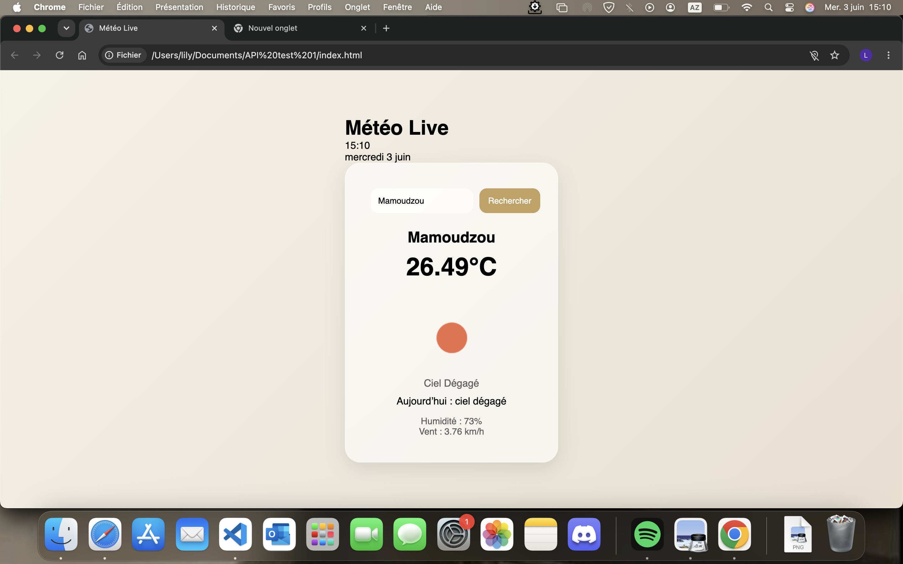

# 🌤️ Weather Live App

Application météo interactive développée en JavaScript utilisant l’API OpenWeatherMap.

---

## 📸 Preview

---
👉 https://devbylilyane.github.io/weather_API-app/

---

## 🧠 À propos du projet

Weather Live App est une application web permettant d’obtenir la météo d’une ville en temps réel.  
Elle consomme une API REST externe et affiche les données de manière dynamique dans l’interface.

Ce projet m’a permis de pratiquer :
- les requêtes asynchrones avec Fetch API
- la manipulation du DOM
- la gestion des états (loading / erreurs / affichage dynamique)
- l’utilisation d’une API externe

---

## ⚙️ Fonctionnalités

- 🔎 Recherche de météo par ville  
- 📍 Détection automatique de la localisation (géolocalisation)  
- 🌡️ Affichage de la température en temps réel  
- 🌥️ Icônes météo dynamiques  
- 💨 Affichage du vent et de l’humidité  
- ⏳ État de chargement  
- ❌ Gestion des erreurs (ville introuvable / réseau)  
- 🎨 Interface moderne et responsive  

---

## 🛠️ Technologies utilisées

- HTML5  
- CSS3 (glassmorphism, animations)  
- JavaScript (ES6+)  
- Fetch API  
- API REST (OpenWeatherMap)  
- Geolocation API  
- Manipulation du DOM  

---
